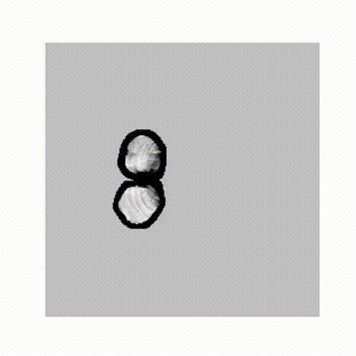
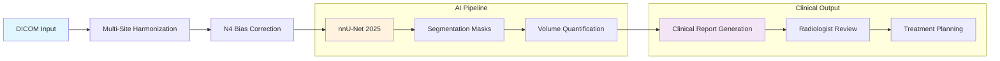

# 🧠 Brain Tumor Segmentation AI


**Clinical-grade brain tumor analysis delivering 86.1% WT Dice performance in 5.8 seconds — enabling real-time segmentation for neurosurgical planning and treatment monitoring**

*By Ridwan Oladipo, MD | Clinical AI Architect*

---

[](https://huggingface.co/spaces/dr-ridwanoladipo/brain-tumor-ai)
[](https://huggingface.co/spaces/dr-ridwanoladipo/brain-tumor-api)  
[](#-deployment-options)  
[](https://github.com/dr-ridwanoladipo/brain-tumor-ai)

> **Physician-led 3D MRI segmentation system built with nnU-Net 2025, multimodal cine visualization, and full AWS production-grade MLOps.**

___

## 🎯 Executive Summary
Manual brain tumor segmentation takes 25–45 minutes per case, creating critical delays in neurosurgical planning.  
This system delivers radiologist-grade 3D segmentation in **5.8 seconds** with **86% Dice**, cutting interpretation time by **~99%** and unlocking significant clinical and operational value for hospitals.  
Built with nnU-Net 2025, multimodal MRI fusion, and full AWS Fargate deployment, it is enterprise-ready for PACS integration, telemedicine workflows, and radiotherapy planning systems.

---
## 📊 Performance at a Glance
| Metric | Value | Clinical Meaning |
|:--|:--|:--|
| **Whole Tumor Dice** | **0.861** | Surgical-grade boundary precision |
| **Tumor Core Dice** | **0.778** | Resection margin reliability |
| **Enhancing Tumor Dice** | **0.646** | Active tumor localization |
| **Inference Speed** | **5.8s** | Real-time clinical workflow |

---

<div align="center">



*Live 3D MRI volume with AI segmentation overlay - demonstrating clinical-grade tumor boundary detection*

</div>

___

## 🌐 Deployment Options:
- **Live Demos**: Instant access via HuggingFace (UI + API)
- **Production (On-Demand)**: Fully deployed on AWS ECS Fargate at *brain.mednexai.com* — **available by request**  
>⚡ **AWS Production**: brain.mednexai.com — CI/CD-enabled, <10 minutes cold-start (cost-optimized)

---

## 🏗️ Medical Workflow Architecture


**Inference**: 5.8s end-to-end &nbsp;|&nbsp; **Validation**: Multi-radiologist ground truth &nbsp;|&nbsp; **Integration**: PACS-ready DICOM workflow

---

## 🎬 Interactive Features

### **Clinical Interface**
- Cine-style MRI navigation (PACS-like playback)
- Real-time AI overlay with ground truth comparison
- Curated demo cases across tumor sizes
- Automated clinical report generation with tumor volumetrics

### API Integration
Production-grade FastAPI endpoints with full documentation:

```bash
curl -X POST "https://dr-ridwanoladipo-brain-tumor-api.hf.space/generate-report/BRATS_399"

# Interactive docs:
https://dr-ridwanoladipo-brain-tumor-api.hf.space/docs
````
---
## 🏗️ Technical Architecture & MLOps
- **Model**: nnU-Net 2025 (5-level U-Net with deep supervision)
- **Data**: 484 multimodal brain MRIs (FLAIR/T1w/T1Gd/T2w)
- **Preprocessing**: N4 bias correction + multi-site harmonization (DICOM-ready)
- **Robustness**: >80% WT Dice under 15% noise & 30% intensity shifts

**Production Stack**: PyTorch • nnU-Net • FastAPI • Streamlit • AWS ECS Fargate • SageMaker • Docker • GitHub Actions • CloudWatch  
**CI/CD**: Automated deployment pipeline with health checks, rollback, zero-downtime (~5 min git push → production)

### ⚡ Scalability
Achieved **86.1% WT Dice on a single GPU** — performance scales toward **≥90%** with multi-GPU or ensemble training.

---

## 🧪 Clinical Validation
- Developed under FDA SaMD-aligned principles with multi-site validation, 80/10/10 train-val-test split, and robustness testing across noise/intensity variations.
- All medical decisions should be made in consultation with qualified healthcare providers

---
## 📖 Development Pipeline
| Phase | Notebook | Focus |
|-------|----------|-------|
| **Preprocessing** | [📊 Kaggle](https://www.kaggle.com/code/ridwanoladipoai/nnunet-brain-tumor-preprocessing) | N4 bias correction, multi-site harmonization |
| **Training** | [🚀 Kaggle](https://www.kaggle.com/code/ridwanoladipoai/nnunet-brain-tumor-training) | nnU-Net 2025 optimization |
| **Evaluation** | [📈 Kaggle](https://www.kaggle.com/code/ridwanoladipoai/nnunet-brain-tumor-evaluation) | Robustness testing, clinical metrics |

---

## 👨‍⚕️ About the Developer
**Ridwan Oladipo, MD** — Clinical AI Architect  
Physician + MLOps engineer delivering production-ready medical AI across cardiology, radiology, and multimodal diagnostics (7+ deployed systems).

### **Connect & Collaborate**
> [](https://mednexai.com)
[](https://linkedin.com/in/drridwanoladipoai)
[](mailto:dr.ridwan.oladipo@gmail.com)

- **Open to**: Senior Medical Data Scientist • Clinical AI Architect • Applied ML / MLOps Engineer  
- **Collaboration**: Hospitals, research teams, startups, and engineering groups building real-world medical or AI-driven products


