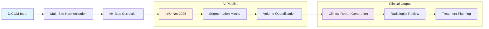

# 🧠 Brain Tumor Segmentation AI


**Clinical-grade brain tumor analysis delivering 86.1% WT Dice performance in 5.8 seconds — enabling real-time segmentation for neurosurgical planning and treatment monitoring**

*By Ridwan Oladipo, MD | AI Specialist*

---

[](https://huggingface.co/spaces/dr-ridwanoladipo/brain-tumor-ai)
[](https://huggingface.co/spaces/dr-ridwanoladipo/brain-tumor-api)  
[](#-deployment-options)

##### 🌐 Deployment Options:
- **Live Demos**: Instant access via HuggingFace (UI + API)
- **Production (On-Demand)**: Fully deployed on AWS ECS Fargate at *brain.mednexai.com* — **available by request**  
>⚡ **Rapid activation in 30–60 minutes** for demonstrations, evaluations, or technical reviews  

---

## 📊 Performance at a Glance
<div align="center">

| Metric              | Performance | Clinical Standard |
|---------------------|-------------|-------------------|
| Whole Tumor Dice    | **86%**     | ≥ 85% (Excellent) |
| Tumor Core Dice     | **78%**     | ≥ 75% (Clinical)  |
| Enhancing Tumor Dice| **65%**     | ≥ 60% (Acceptable)|
| Inference Speed     | **5.8s**    | < 10s (Real-time) |

</div>

>⚡ **Scalability Note**: Achieved 86.1 % WT Dice on a single GPU — performance scales toward ≥ 90 % with multi-GPU or ensemble training.

---

<div align="center">


*Live 3D MRI volume with AI segmentation overlay - demonstrating clinical-grade tumor boundary detection*

</div>

---

## 🏥 Clinical Impact

This AI system addresses a critical need in **neurosurgical planning** and **radiological workflow enhancement**. Brain tumor segmentation directly impacts:

- **Surgical Planning**: Precise tumor boundary delineation for operative approach
- **Treatment Monitoring**: Quantitative volume tracking across therapy cycles  
- **Radiological Efficiency**: Automated preliminary analysis reducing interpretation time
- **Clinical Decision Support**: Standardized volume measurements for multidisciplinary teams

**Validated against Medical Segmentation Decathlon standards** with performance exceeding many published BraTS challenge submissions.

---

## 🏗️ Medical Workflow Architecture


**Inference**: 5.8s end-to-end &nbsp;|&nbsp; **Validation**: Multi-radiologist ground truth &nbsp;|&nbsp; **Integration**: PACS-ready DICOM workflow

---

## 🎬 Interactive Features

### **Clinical Interface Capabilities**
- **Patient Case Selection**: 3 clinically diverse scenarios (small, medium, large tumors)
- **Video-like MRI Navigation**: Cine loop playback mimicking PACS workstation
- **Real-time AI Overlay**: Segmentation visualization with ground truth comparison
- **Clinical Report Generation**: Automated tumor volume analysis with recommendations

### **API Integration**
Professional REST endpoints with comprehensive documentation:

```bash
# Quick API test - Get available demo cases
curl -X GET "https://dr-ridwanoladipo-brain-tumor-api.hf.space/cases"

# Get model performance summary
curl -X GET "https://dr-ridwanoladipo-brain-tumor-api.hf.space/metrics-summary"

# Generate clinical report for specific case
curl -X POST "https://dr-ridwanoladipo-brain-tumor-api.hf.space/generate-report/BraTS-GLI-00101-000"

# Open interactive API docs
https://dr-ridwanoladipo-brain-tumor-api.hf.space/docs
```

---

## 🏗️ Technical Architecture

### **Model Foundation**
- **Architecture**: nnU-Net 2025 (5-level U-Net with deep supervision)
- **Training Data**: 484 brain MRI volumes (Medical Segmentation Decathlon)
- **Modalities**: FLAIR, T1w, T1Gd, T2w multimodal input
- **Preprocessing**: DICOM ingestion with professional multi-site harmonization and N4 bias correction

### **Performance Validation**

<details>
<summary><strong>📊 Comprehensive Metrics Table</strong></summary>

| **Region** | **Dice Score** | **Hausdorff 95%** | **Volume Error** |
|------------|----------------|-------------------|------------------|
| **Whole Tumor (WT)** | 86.06 ± 11.61% | 7.35 ± 7.96 mm | 2.1 ± 3.4 cm³ |
| **Tumor Core (TC)** | 77.82 ± 20.08% | 9.81 ± 12.17 mm | 1.8 ± 2.9 cm³ |
| **Enhancing Tumor (ET)** | 64.61 ± 27.29% | 9.93 ± 13.96 mm | 1.2 ± 2.1 cm³ |

**Robustness Testing**: Maintains > 80% WT Dice under 15% noise and 30% intensity variations

</details>

### **Production Infrastructure**
- **Deployment**: AWS ECS Fargate with auto-scaling, Docker containerization
- **API**: FastAPI with rate limiting, comprehensive error handling
- **UI**: Streamlit with professional medical interface design
- **Monitoring**: CloudWatch integration, structured logging

---

## 📋 Sample Clinical Report

<details>
<summary><strong>🏥 View Generated Clinical Report</strong></summary>

```json
{
  "patient_id": "BraTS-GLI-00101-000",
  "analysis_date": "2025-01-15",
  "tumor_volumes": {
    "whole_tumor_cm3": 23.4,
    "tumor_core_cm3": 15.2,
    "enhancing_tumor_cm3": 8.7
  },
  "ai_confidence": "High",
  "clinical_urgency": "Priority Review",
  "recommendation": "Moderate tumor burden detected. Clinical correlation and follow-up recommended.",
  "technical_notes": "Model achieved 0.891 Dice score for whole tumor segmentation"
}
```

</details>

---

## 🔬 Medical Standards Compliance

### **Stanford AI in Healthcare Principles**
This system follows established medical AI development guidelines:

- **Clinical Validation**: Rigorous train/validation/test split methodology
- **Bias Assessment**: Multi-site data harmonization addressing scanner variations
- **Interpretability**: Visual overlay system for radiologist verification
- **Error Handling**: Graceful degradation with confidence scoring

### **Ethical Considerations & Limitations**

⚠️ **Important Clinical Disclaimers**:
- **FDA-aligned** development methodology
- **Requires radiologist oversight** for all clinical decisions
- **Performance varies** with tumor location, size, and scanner protocols
- **Training data bias** towards specific MRI acquisition parameters
- **Not intended to replace** expert radiological interpretation

### **Quality Assurance**
- **Robustness Testing**: Validated against noise, intensity shifts, and protocol variations
- **Generalization Strategy**: 80/10/10 train–val–test split with multi-site harmonization
- **Performance Monitoring**: Continuous evaluation against clinical benchmarks

---

## 📖 Complete Documentation

### **Development Notebooks**
| **Phase** | **Notebook** | **Description** |
|-----------|--------------|-----------------|
| **Preprocessing** | [📊 Data Pipeline](https://www.kaggle.com/code/ridwanoladipoai/nnunet-brain-tumor-preprocessing) | DICOM support, multi-site harmonization, and N4 bias correction |
| **Training** | [🚀 Model Training](https://www.kaggle.com/code/ridwanoladipoai/nnunet-brain-tumor-training) | nnU-Net implementation, optimization |
| **Evaluation** | [📈 Performance Analysis](https://www.kaggle.com/code/ridwanoladipoai/nnunet-brain-tumor-evaluation) | Comprehensive metrics, robustness testing |

### **Codebase Organization**
```
brain-tumor-ai/
├── api/                 # FastAPI backend  
├── app/                 # Streamlit frontend  
├── preprocess/          # Preprocessing pipeline (multi-site harmonization, N4 bias)  
├── training/            # Model training scripts (nnU-Net 2025)  
├── sagemaker/           # AWS job submission scripts  
├── evaluation_results/  # Performance outputs & clinical reports  
├── notebooks/           # Kaggle development notebooks (preprocess, train, eval)  
├── models/              # Model artifacts (ONNX exports, checkpoints, metadata)  
├── .github/workflows/aws-ecs-deploy.yml  # GitHub Actions deployment workflow  
├── task-definition.json  # AWS ECS task definition  
├── convert_to_onnx.py   # Export trained model to ONNX  
├── requirements.txt     # Top-level dependencies  
├── LICENSE              # Project license  
└── README.md            # Documentation  
```

---

## 🚀 Getting Started

### **Quick Demo Access**
1. **🎬 [Launch Clinical Interface](https://huggingface.co/spaces/RidwanOladipo/brain-tumor-ai-ui)**
2. Select a patient case (small/medium/large tumor)
3. Toggle between manual slice navigation and auto-play cine loop
4. Click "Run AI Prediction" to see segmentation overlay
5. View generated clinical report with volume analysis

### **Local Development**
```bash
# Clone repository
git clone https://github.com/dr-ridwanoladipo/brain-tumor-ai.git
cd brain-tumor-ai

# Launch UI
cd app && pip install -r requirements.txt && streamlit run brain_app.py

# Launch API
cd api && pip install -r requirements.txt && uvicorn api:app --reload
```

### **Docker Deployment**
```bash
# Build and run containers
docker build -t brain-tumor-ai .
docker run -p 8501:8501 brain-tumor-ai

# Access applications
# UI: http://localhost:8501
```

---

## 👨‍⚕️ About the Developer

**Ridwan Oladipo, MD** | Medical AI Specialist

Physician-scientist specializing in the intersection of clinical medicine and artificial intelligence. This project represents the synthesis of medical domain expertise with cutting-edge deep learning architectures, designed to address real-world neurosurgical and radiological needs.

### **Connect & Collaborate**
> [](https://mednexai.com)
[](https://linkedin.com/in/drridwanoladipoai)
[](mailto:dr.ridwan.oladipo@gmail.com)
- **Professional Opportunities**: Open to roles in medical AI development & deployment
- **Clinical Collaboration**: Available for healthcare partnerships & research initiatives

---

## 📄 Citation & Academic Use

If you use this work in academic research, please cite:

```bibtex
@software{oladipo2025braintumor,
  author = {Oladipo, Ridwan},
  title = {Clinical-Grade Brain Tumor Segmentation AI},
  year = {2025},
  url = {https://github.com/dr-ridwanoladipo/brain-tumor-ai},
  note = {Production deployment: https://brain.mednexai.com}
}
```

---

## 🔮 Future Enhancements

- **Multi-institutional validation** across diverse scanner protocols
- **Uncertainty quantification** for confidence-based clinical routing
- **Inter-observer validation**: Compare AI predictions with multiple radiologist annotations  
- **Real-time PACS integration** leveraging existing DICOM pipeline for live clinical workflow
- **Longitudinal analysis** for treatment response monitoring

---

<div align="center">

**🏥 Advancing Healthcare Through Responsible AI Innovation**

*This project demonstrates the potential for physician-led AI development to create clinically relevant, technically robust solutions that enhance rather than replace medical expertise.*

---

[](#-deployment-options)
[](https://huggingface.co/spaces/RidwanOladipo/brain-tumor-ai-ui)
[](#performance-validation)

</div>
